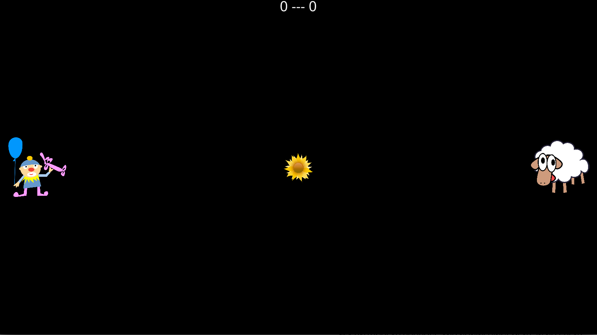

# pongcade

Simple two player game in Python using the [arcade](https://arcade.academy) library.

## Screenshots

## Requirements

* Python 3
* Video card supported by the arcade library (NVidia, ATI, or any recent onboard Intel should work)

## Run

Run the `pongcade.py` python script.

## Play

* Use the `W` and `S` keys to control player 1
* Use the `Up` and `Down` arrow keys to control player 2
* Press `Space` key to start the game
* Press the `F` key to switch between windowed and full screen mode

## Bugs

Open an issue.

## License

* Pongcade game is [GPLv3 or later](https://www.gnu.org/licenses/gpl-3.0.en.html)
* [Graphics](https://openclipart.org/share) and [sounds](https://gamesounds.xyz/Sound%20Effects/LICENSE) are public domain
* Arcade library is MIT
